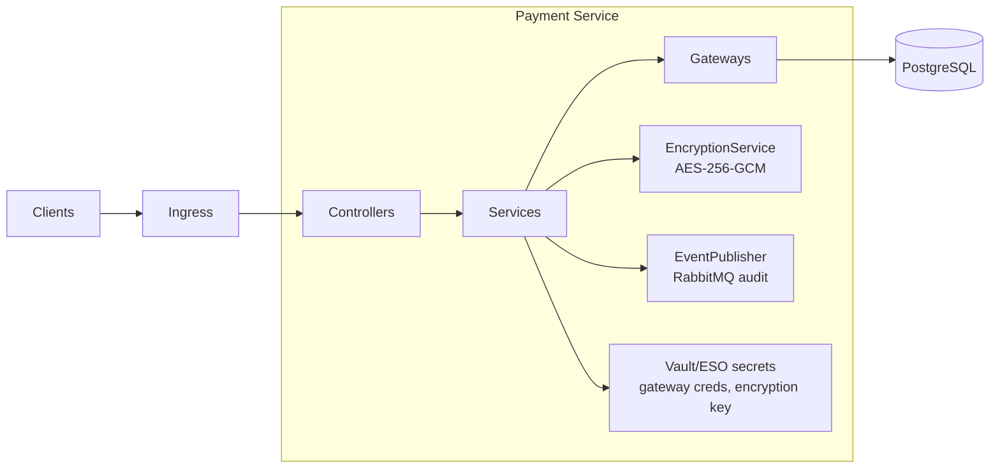
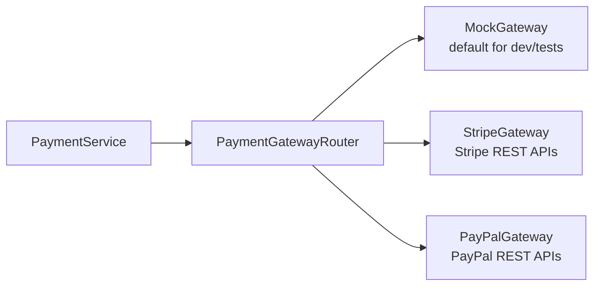

# Payment Service — Architecture

## Overview
The payment service is a Spring Boot 3 application that runs in its own `shopping-cart-payment` namespace for PCI DSS isolation. It exposes REST APIs for payment/capture/refund flows, talks to PostgreSQL for persistence, and integrates with Stripe/PayPal gateways via pluggable adapters. Secrets are sourced from Vault/ESO and mounted as Kubernetes secrets specific to this namespace.

## Component Diagram

## Namespaces & Isolation
- Deployed in `shopping-cart-payment` namespace, not the shared `shopping-cart-apps` space.
- NetworkPolicies restrict inbound traffic to the ingress gateway and order service.
- Secrets (DB credentials, gateway keys, encryption key) are defined only in this namespace.

## Security & Compliance
- **Encryption:** AES-256-GCM with explicit UTF-8 handling; key provided via `payment-encryption-secret`.
- **Tokenization:** Payment methods stored as tokens (no raw PAN storage).
- **Logging:** Sensitive fields masked; PCI scope endpoints audited.
- **Auth:** OAuth2 Resource Server validates JWTs; role-based checks guard admin endpoints.

## Gateway Abstraction

Gateways share a common interface and are configured via `application.yml` toggles. Credentials come from Vault-sourced Kubernetes secrets.

## Data Flow
1. Controller receives payment request, validates payload.
2. Service ensures idempotency, loads order/payment metadata, encrypts sensitive data.
3. GatewayRouter selects configured gateway and executes charge/refund.
4. Repository persists transaction + audit trail.
5. Events/logs emitted for downstream auditing.

## External Secrets Operator / Vault
- `payment-db-secret`, `payment-gateway-secrets`, and `payment-encryption-secret` are managed via ESO pointing to Vault paths.
- Vault policies restrict access to the payment namespace only.

## Deployment
- Packaged via multi-stage Docker build (maven → distroless base).
- Kubernetes manifests include dedicated namespace, service account, network policies, and strict securityContext.
